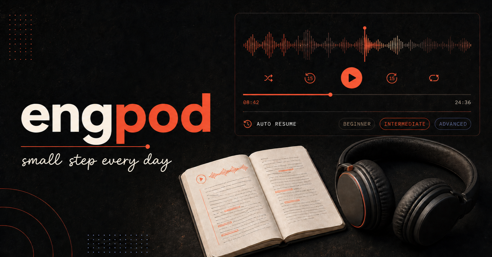

# engpod 🎧

small step every day

`engpod` is a friendly, phone-ready English listening library with 365 short
podcast lessons, transcripts, vocabulary notes, and a player that remembers
where you stopped.



## Highlights

- Pick an episode and it starts playing immediately
- Search, sort, shuffle, filter, and group lessons by level
- Resume the last episode from the saved position
- Remember loop, autoplay-next, transcript, speed, and display settings
- Read local transcripts and vocabulary notes
- Use comfortably on desktop and mobile browsers
- Keep everything private in browser storage; no account or analytics

## Run locally

Install Node.js 24 or newer:

```bash
npm install
npm run dev
```

Open `http://localhost:3000`.

## Audio

Audio streams from the public Internet Archive `englishpod_all` collection.
The player uses two direct HTTPS media nodes and automatically falls back to the
collection download URL if one is unavailable.

## Credits

Episode metadata and transcripts were adapted from
[huynhthientung/english-pod](https://github.com/huynhthientung/english-pod).
Audio is served by
[Internet Archive](https://archive.org/details/englishpod_all).
The motivational tagline uses
[Patrick Hand](https://fonts.google.com/specimen/Patrick+Hand), distributed
under the included [SIL Open Font License](public/fonts/PatrickHand-OFL.txt).
